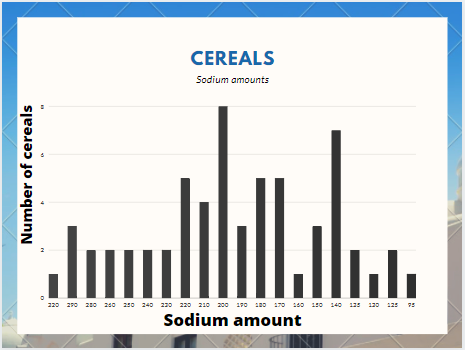
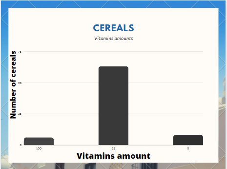
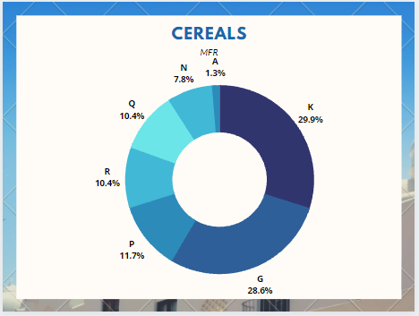
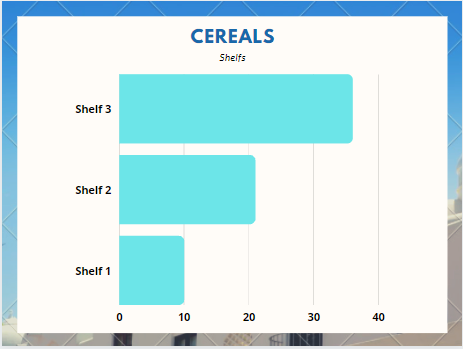
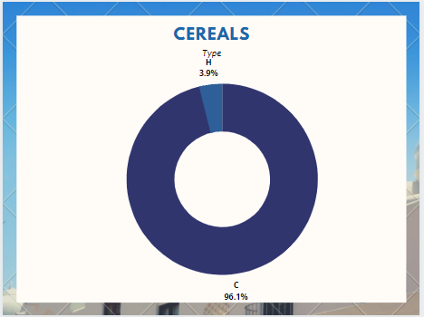

# LearningScala
 ## Used database: https://www.kaggle.com/crawford/80-cereals
 
 ## Used technologies:
  1. spark.
  2. scala.
  3. sql.

 ## Tasks:
  1. read csv file.
  2. show the dataframe.
  3. print schema.
  4. make some analysis on the data (5 queries) using the two spark approches.
 
 ## Analytics
 
 
 
 
 

